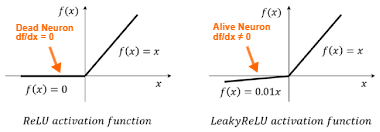
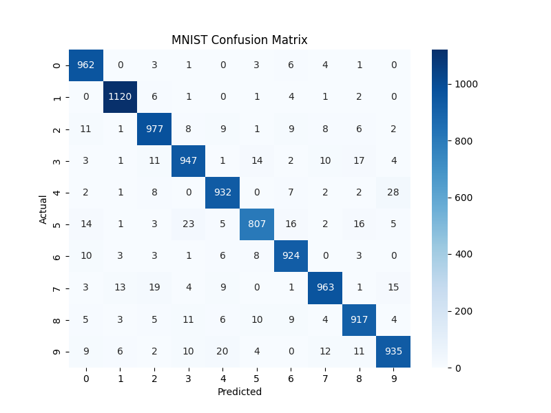

# Neural Network
*personal project of building a feedforward dense neural network using only numpy*


<br>


<p style="font-size:10px; font-style: italic; ">Image Reference 1</p>

# Overview

<p>
This repository represents a personal project of coding a basic feedforward neural network from scratch in order to gain a deeper understanding for the inner-workings of machine learning libraries. While I aimed to avoid blindly copying code, I was also not trying to reinvent the wheel so began by heavily researching neural networks, backpropogation equations, and how others generally structure code for similar projects. I also utilized numpy for quick array processing and linear algebra functionalities. 
</p>

<br>

# Project Goals

The primary goals for this project were:  
1. Learn the calculus and linear algebra behind backpropogation in neural networks  
2. Implement a python neural network library using only numpy
3. Build models using custom neural network library and test them on simple datasets

<br>

# Design and Development Process
The game was developed using HTML5 Canvas, which provides basic functionalities for drawing to pixel locations on a canvas. Since it was made without a game engine, the object inputs, collision, and game UI had to be handled manually. The order that the project was   
1. **Research**:  
   - Initial research involved watching thoroughly through 3Blue1Brown's series on deeplearning (see Ref3)
   - For learning general code structuring and organization for this project I utilized a similar approach as Ref2
   - For implementing backpropogation I first followed derivations of Ref1. The most challengin gpart was converting those component=wise equations into matrix notation and then into numpy calculations. 
2. **Troubleshooting**:  
   - The majority of the time on the project was spent debugging and troubleshooting errors
   - Some of the bugs included forgetting to add in bias during the feedforward, accidentally performing gradient ascent instead of descent, and forgetting to apply the activation function during the feedforward
   - With the majority of bugs fixed the model was performing decently on basic tests but not superbly
3. **Finetuning and Fixes**:  
   - One of the most impactful improvements to the model was incorporating momentum. This adjustment made gradient descent less sensitive to local minima by having the descent behave more like a ball rolling downhill, smoothly landing in a deep minima
   - By this point the model would achieve high accuracy in most cases but occasionally would perform terribly. By logging the gradients, I identified the issue was caused by vanishing gradients. Switching to a leaky ReLU activation function resolved this, as its neurons would never fully 'die' but only become less impactful
    <div style="margin-left:40px">
    
    <p style="font-size:10px; font-style: italic; ">Image Reference 2</p>
    </div>
4. **Model Tests**:  
   - **XOR TEST**: The first test I applied to a model was in solving the XOR problem. The XOR problem involves determing an output based on if two inputs are different (OR AND NAND). Linear models can't solve it because a single line can't separate the categories in the input space. Using a non-linear model with my custom Network class achieved 100% accuracy
   - **MNIST TEST**: The second test was on the MNIST dataset, a classic machine learning dataset consisting of handwritten digits (0-9). The dataset was downloaded from Kaggle and loaded with Kaggle resources (Ref4). I set up my model with two hidden layers of 32 and 16 nodes. After 200 epochs the model achieved 94.6% accuracy on the test set. 
   

<br>

# Using this repository
This repository is not meant to compete with libraries such as PyTorch or ScikitLearn - my code is admittedly too slow and less flexible. If you are just interested in trying out the code of this repository, however, I'll provide a short guide: 
1. **Download**: 
- Download the repository with ```git clone https://github.com/briansheldon1/NeuralNetwork.git```
2. **Creating Model**: 
- The main Network() class can be found in  
- To create an instance of this class you should pass in 'layers', which is an array or tuple of layer sizes (including non-hidden layers)
- For example, to build a model with 2 inputs, 1 output, and a single hidden layer of size 2 then I would instantiate my network with ```my_network = Network(layers=[2, 2, 1])```
3. **Training Model**:
- To see how models were trained check out  or 
- To train the model first setup a np.array of inputs (X) and a np.array of outputs (y). You can use the train_test_split in  to divide the samples into training and testing samples
- To train the model you can run ```Network.fit(X_train, y_train)```. It is recommended to also set the kwargs of epochs, batch_size and verbose
4. **Saving/Loading Model**:
- To save a model you can utilize the ```Network.save_model(save_path: string)``` method which saves the model parameters in a pkl file to the given path.
- Similarly you can load a model using ```Network.load_model(load_path: string)```
5. **Testing the Model**:
- One option for testing the accuracy is ```Network.test_accuracy(X_test, y_test)``` which will output the percent of testing examples that the model correctly predicted.
- For the mnist dataset a confusion matrix was also used (see ) which was created using confusion_matrix_plot from 

</br>

# Reflection
I feel I have succeeded in completing my personal goal of gaining a deeper understanding of neural networks. Through wrangling backpropogation equations into working algorithms and troubleshooting my model, I've delved into the inner-workings of the most basic form of a neural network. While my main goal was to understand backpropogation, I ended up learning about the importance of countless other topics such as momentum, optimizers, and activation functions. Even though I have somewhat demystified neural networks for myself, I still find it magical watching them learn and improve. 


<br>

# References
<ol>
    <li><a href="https://brilliant.org/wiki/backpropagation/" target="_blank">Brilliant: Backpropagation</a></li>
    <li><a href="https://pyimagesearch.com/2021/05/06/backpropagation-from-scratch-with-python/" target="_blank">PyImageSearch: Backpropagation from Scratch</a></li>
    <li><a href="https://www.youtube.com/watch?v=aircAruvnKk&list=PLZHQObOWTQDNU6R1_67000Dx_ZCJB-3pi" target="_blank">3Blue1Brown</a></li>
    <li><a href="https://www.kaggle.com/code/hojjatk/read-mnist-dataset" target="_blank">Kaggle: MNIST Dataset</a></li>
</ol>


## Images
<ol>
    <li><a href="https://www.geeksforgeeks.org/artificial-neural-networks-and-its-applications/" target="_blank">Feedforward NN Image</a></li>
    <li><a href="https://www.researchgate.net/figure/ReLU-activation-function-vs-LeakyReLU-activation-function_fig2_358306930" target="_blank">ReLU vs Leaky ReLU Image</a></li>
</ol>